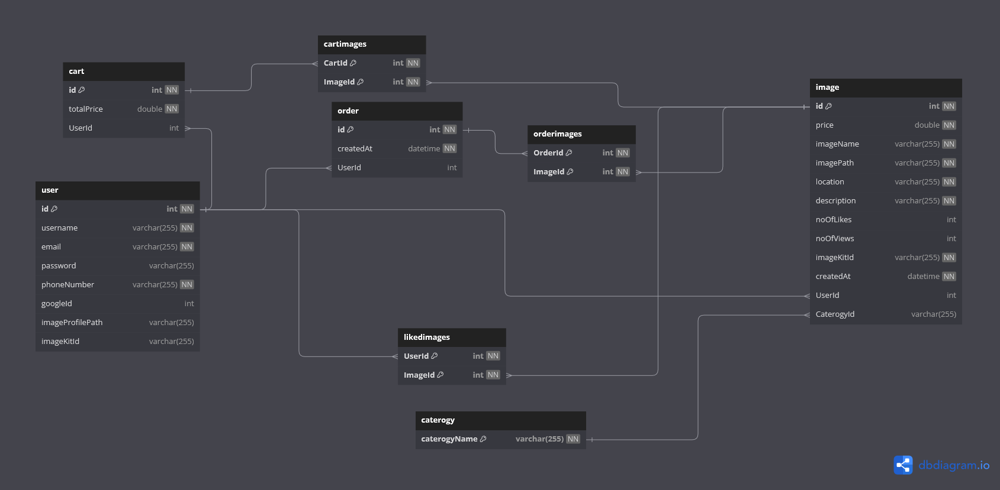

# Image-Craft API

## Overview

This is an api for my graduation project that is an online image platform that serves many images for many categories with features that enhances the user experience like searching by image and so on. The api contain many features like authentication, caching some data to enhance the performance, end to end testing, complex queries, validation and so on.

## Table of Contents

- [Image-Craft API](#image-craft-api)
  - [Overview](#overview)
  - [Table of Contents](#table-of-contents)
  - [Features](#features)
  - [Technologies](#technologies)
  - [Deployment](#deployment)
  - [Installation](#installation)
  - [Configuration](#configuration)
  - [API Endpoints](#api-endpoints)
  - [Database Design](#database-design)

## Features

- **User Authentication:** Secure user authentication with Access Tokens and Refresh Tokens using JWT (Json Web Token) and store Refresh Tokens in cookies
- **Validation :** validating inputs using JOI .
- **Error handling:** using a global error handler with a custom error class.
- **E2E TESTING:** test the fuctionality of the end points using jest, supertest and sinon.
- **Google oAuth:** authentication using google OAuth without using any library.
- **OTP Verification:** Enhanced securtiy for user actions.
- **Payment Integration:** Integrate with a payment gateway like stripe.
- **Image Upload & Download:**  Image is uploaded using multer and client can download the image.
- **Database Managment:** API manage the database entities and perform complex queries like atomic update, join between tables and so on.
- **Pagination:** using pagination to enhance the performance of the response
- **Security:** using rate limiter to get protected from DOS and brut force attacks and using helmet package to set the response headers

## Technologies

- **Node.js**
- **Express.js**
- **Mysql/Sequelize**
- **Redis**
- **Jest/Supertest/sinon**
- **Multer**
- **Stripe**
- **JWT/Cookies**

## Deployment

The api is deployed on render.com (without redis service), database is deployed on clever-cloud.com and images are stored on cloud service called image-kit.
Here is the base url => <https://image-craft-cvnj.onrender.com>

## Installation

   ```sh
   // Clone the repository
    git clone https://github.com/Mohamedelbayoumi/Image-Craft.git
    
    // Navigate to the project directory
    cd yourproject
    
    // Install dependencies
    npm install

    // Run the application
    node app.js or npm run dev:start
  ```

## Configuration

- *node version >=18.12.1*
- *Mysql DBMS*
- *Redis server*
- *set the values of environment variables that exist in .env.example file*

## API Endpoints

For detailed API documentation, please import the Image Craft API.postman_collection.json or
visit <https://documenter.getpostman.com/view/33954963/2sA3Bt3pkX>

**Authentication**

- *POST /api/v1/signup* - Register a new user
- *POST /api/v1//login/:device* - Login a user and return tokens
- *POST /api/v1/logout* - sign the user out
- *POST /api/v1/passwordReset* - enable user tot reset password
- *POST /api/v1/otp-verification* - check the validation of the otp
- *PATCH /api/v1/new-password* - updates the user password
- *GET /api/v1/newToken* - create a new access token
- *GET /api/v1/google-authentication* - enable google registeration

**Images**

- *GET /api/v1/images* - returns images using pagination
- *GET /api/v1/images/search* - returns images with a specific name
- *GET /api/v1/images/search/price* - returns images in the order of price
- *GET /api/v1/image* - returns details about a single image
- *GET /api/v1/images/caterogy/:caterogy* - returns images of a caterogy
- *GET /api/v1/image-downloading/:imageId* - download an image
- *POST /api/v1/images* - upload an image
- *POST /api/v1/searching-by-image* - returns the images that look like the searched image
- *DELETE /api/v1/image* - delete an image

**Cart**

- *GET /api/v1/cart* - returns cart content
- *POST /api/v1/cart* - add an image to the cart
- *GET /api/v1/cart/:imageId* - delete an image from the cart
- *DELETE /api/v1/cart* - delete the cart

**Checkout**

- *POST /api/v1/payment-intent* - returns payment intent created by stripe
- *POST /api/v1/order* - create an order

**User**

- *GET /api/v1/profile/liked-images* - returns liked images for user
- *GET /api/v1/profile/uploaded-images* - returns uploaded images for user
- *GET /api/v1/profile/ordered-images* - returns ordered images for user
- *GET /api/v1/profile* - returns profile user data
- *POST /api/v1/images/like/:imageId* - enable user to like an image
- *POST /api/v1/images/unlike/:imageId* - enable user to unlike an image
- *PATCH /api/v1/profile/image* - update the user profile image
- *DELETE /api/v1/user* - deletes the user's account

## Database Design


